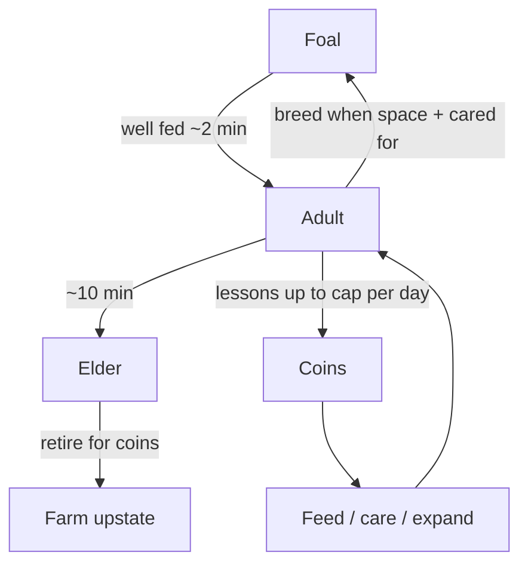

# Horse Stable — Game Design Document

**Project:** `horse-stable/` in GamesForNorah  
**Audience:** Norah (child player), iPad touch-first — designed for calm, one-task-at-a-time pacing in a hospital setting  
**Genre:** Top-down ranch / virtual pet management simulator  
**Stack:** Vite + TypeScript + Phaser 3, static-hostable  
**Last updated:** June 2026

---

## 1. Vision

Run a friendly horse ranch: feed and care for horses, teach riding lessons to earn coins, grow the stable through breeding, age horses through their life cycle, and retire elders to a farm upstate. The tone is calm and encouraging — no failure states, no harsh penalties.

Design pillars:

- **Touch-first** — large tap targets, pan the paddock (left viewport), fixed sidebar (right).
- **One focus at a time** — only one alert/task visible; calm cooldown after completing work; gentle idle suggestions so the player is never overwhelmed or bored.
- **Rapid growth loop** — foals grow up when fed, adults breed consistently, elders retire for coins.
- **Multilingual** — Basque, German, Spanish (default: **Spanish**).

---

## 2. Core loop

1. **Care for horses** — satisfy needs via sidebar actions when a horse is selected.
2. **Earn coins** — riding lessons (adults, daytime, daily cap), sell extras, retire elders, daily dawn bonus.
3. **Grow the herd** — adults breed automatically when well cared for and stable has space.
4. **Manage capacity** — always keep **2 adults minimum**; sell foals/extras or retire elders when ready.
5. **Follow the focus banner** — one gentle task at a time in the sidebar.

---

## 3. World & UI layout

| Area | Purpose |
|------|---------|
| **Paddock (left viewport)** | Horses wander; pan by drag; tap to select |
| **Fixed sidebar (right)** | Stats, focus banner, clock, audio toggles, horse card, actions — never overlays paddock |
| **Stable** | Capacity markers; 8 initial stalls (+2 per expansion) |
| **Lesson queue** | Kids wait west of paddock; hidden at night |

**Camera:** Dual-camera split — `cameras.main` renders world in left viewport; `uiCamera` renders sidebar. World is 1600×1000; RESIZE scale mode.

**Art style:** Programmatic pixel textures in `RanchScene.createTextures()`. Six coat colors; foals smaller, elders slightly faded.

---

## 4. Horses & life cycle

### Age stages

| Stage | Behavior |
|-------|----------|
| `foal` | Cannot give lessons; grows to adult in ~2 min when hunger ≥ 45 |
| `adult` | Lessons, breeding, sleep; ages to elder in ~10 min |
| `elder` | Limited actions (pet, carrots, retire); retire for coins |

### Key fields

| Field | Meaning |
|-------|---------|
| `growthMs` | Foal growth progress (0 → `GROWTH_MS`) |
| `lifeMs` | Adult aging progress (0 → `ADULT_LIFE_MS`) |
| `lessonsToday` | Lessons used today (resets at dawn) |
| `value` | Sell/retire payout baseline |
| `needs` | hunger, affection, cleanliness, exercise (0–100) |

### 2-adult floor

You must always maintain **at least 2 adult horses**. Sell (`findHome`) and retire are blocked if removing the horse would drop adults below 2.

### Breeding

When ≥2 adults exist, stable not full, and average adult care ≥ 50, `breedingProgress` advances. At `BREED_MS` (~45 s of good care), a foal spawns with celebration.

---

## 5. Single-focus attention pacing

Designed for a hospitalized child: **one clear task at a time**, never a wall of alerts.

| Mechanism | Value / behavior |
|-----------|------------------|
| `FOCUS_COOLDOWN_MS` | 3 s calm beat after resolving ("Nice work!") |
| `IDLE_SUGGEST_MS` | 14 s with nothing pressing → gentle suggestion (pet / lesson) |
| Priority | critical need > elder retire > foal needs food > plain need > idle suggestion |

Only the focus horse shows a world alert bubble. Sidebar focus banner is tappable to select and center that horse.

---

## 6. Day / night cycle

| Constant | Value |
|----------|-------|
| `DAYLIGHT_MS` | 468,000 ms (~7.8 min) |
| `NIGHT_MS` | 4,320 ms (~4.3 s) |
| `CYCLE_MS` | sum of above |

Day/night is **visual atmosphere** — breeding and aging are decoupled from sleep. Sleep remains optional at night for adults.

Sidebar clock shows phase, countdown, and active lesson timer.

---

## 7. Economy

### Income

| Source | Amount |
|--------|--------|
| Daily dawn | `8 + horse count` |
| Riding lesson | 5–20 coins (scales with care) |
| Sell horse | `max(35, value)` |
| Retire elder | `max(45, value)` |

### Lessons per day

Each adult can run up to **`LESSONS_PER_ADULT_PER_DAY` (3)** lessons per game day. More adults = more lesson capacity = more income potential.

### Costs

| Action | Cost |
|--------|------|
| Oats | 4 |
| Carrots | 6 |
| Bathe | 8 |
| Expand stable | `120 + expansions × 70` (when full) |

---

## 8. Actions (stage-gated)

| Stage | Available actions |
|-------|-------------------|
| Foal | oats, carrots, pet, bathe, walk, sell |
| Adult | oats, carrots, pet, bathe, walk, lesson, sleep, sell |
| Elder | carrots, pet, retire |
| Global | expand stable (when full) |

---

## 9. Audio

- **BGM:** MP3 playlist in `music/` — loops all tracks in filename order (`npm run playlist` regenerates manifest; copied to `dist/music/` on build).
- **SFX:** Procedural tones in `src/audio/chipSfx.ts`.
- **Independent toggles:** Music (M) and SFX (S) buttons in sidebar; persist separately.
- **UI SFX:** Every sidebar interaction has soft feedback (`uiTap`, `uiSelect`, `uiConfirm`, etc.).

---

## 10. Save system

| Key | `horse-stable:v3` |
| Version | `SAVE_VERSION = 3` |
| Migration | Reads v1/v2/v3; normalizes new horse fields |

Reset: `localStorage.removeItem('horse-stable:v3')`

---

## 11. Balance knobs (`state.ts`)

| Knob | Default |
|------|---------|
| `GROWTH_MS` | 120,000 (~2 min foal → adult) |
| `ADULT_LIFE_MS` | 600,000 (~10 min adult → elder) |
| `BREED_MS` | 45,000 |
| `LESSONS_PER_ADULT_PER_DAY` | 3 |
| `MIN_ADULTS` | 2 |
| `FOCUS_COOLDOWN_MS` | 3,000 |
| `IDLE_SUGGEST_MS` | 14,000 |
| `ALERT_THRESHOLD` | 34 |
| `CRITICAL_THRESHOLD` | 20 |
| `WELL_FED` | 45 |

---

## 12. Input (critical)

**Do not use Phaser `setInteractive()` on horse containers or action buttons.** All taps use screen-space hit testing in `RanchScene.createInput()`:

- World taps → `pickHorseAtPointer` (main camera world coords)
- Sidebar taps → stored `*ButtonHits[]` rects
- Pan only in world viewport (left of sidebar)

---

## 13. Success metrics

A session works when a child can:

- See one clear focus task and complete it without overwhelm
- Feed a foal and watch it grow up
- Run lessons and earn coins; notice the daily cap
- Breed foals when there's space
- Retire an elder and understand the 2-adult rule
- Toggle music/SFX independently
- Pan paddock and tap horses reliably on iPad
